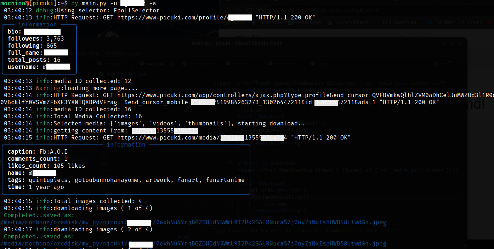
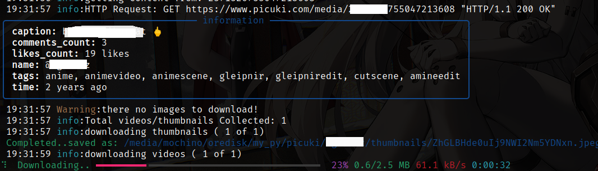
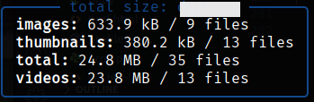

<div align="center">
    <h2>Picuki</h2>

---

Instagram bulk profile media downloader

[](https://www.python.org/downloads/release/python-3100/)
[](https://example.com)
[](https://opensource.org/licenses/MIT)
[](https://github.com/motebaya/Picuki/stargazers)
[](https://github.com/motebaya/Picuki/network/members)

</div>

### TODO

- [x] download all images
- [x] download all videos
- [x] download all thumbnails
- [x] simple profile viewer

note: all content are saved with unique string names.

### install this

```
git clone https://github.com/motebaya/Picuki
cd Picuki
python -m pip install requirements.txt
python main.py
```

### CLI usage

- `-u`, `--username`: spesific instagram username
- `-i`, `--images`: only download all images
- `-v`, `--videos`: only download all videos
- `-t`, `--thumbnails`: only download all thumbnails
- `-a`, `--all`: download all media post from profile
- `-V`, `--verbose`: enable debug mode

output download saved in `./<username>/<images/videos/thumbnails>`

---

- Set multiple arg for multiple choice e.g:

```
python main.py -u johndoe -i -v
```

- Images

  

- videos

  

- result show

  

## License

This project is licensed under the [MIT License](LICENSE).
